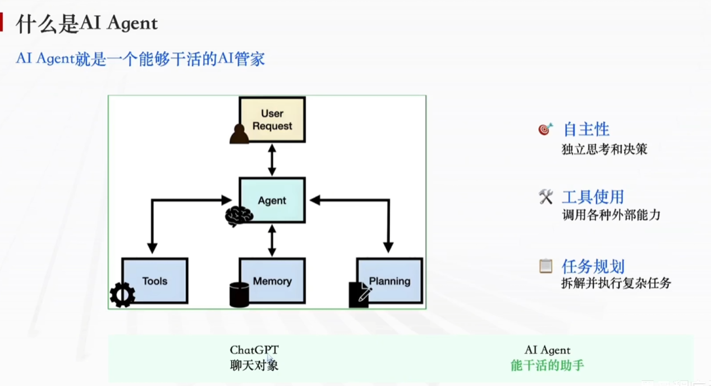
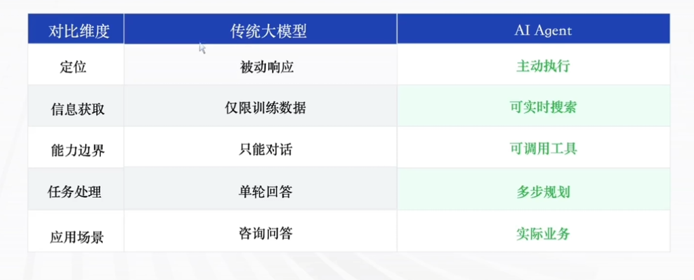
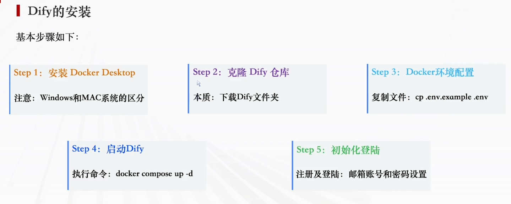

# 1. Dify 第一章学习笔记

---

## 1.1 什么是 AI Agent

### 一、基础定义

**AI Agent** 就是一个能够干活的 **AI 管家**。

#### 核心三大特性

| 特性 | 说明 |
|------|------|
| **自主性** | 独立思考和决策 |
| **工具使用** | 调用各种外部能力 |
| **任务规划** | 拆解并执行复杂任务 |

#### 内部结构组成

| 组件 | 说明 |
|------|------|
| **User Request** | 用户请求，作为输入指令 |
| **Agent** | 核心智能主体（大脑） |
| **Memory** | 记忆模块，存储历史信息 |
| **Planning** | 规划模块，拆分复杂任务 |
| **Tools** | 工具集，各类外部功能接口 |

#### 基础对比区分

- **ChatGPT**：仅聊天对象，被动对话
- **AI Agent**：能干活的助手，可自主执行任务

---

### 二、AI Agent vs 传统大模型

| 维度 | 传统大模型 | AI Agent |
|------|-----------|----------|
| **定位** | 被动响应 | 主动执行 |
| **信息获取** | 仅限训练数据 | 可实时搜索 |
| **能力边界** | 只能对话 | 可调用工具 |
| **任务处理** | 单轮回答 | 多步规划 |
| **应用场景** | 咨询问答 | 实际业务 |

---

### 三、简答题标准答案

**Q：什么是 AI Agent？**
> **答案：** 感知环境、自主决策、使用工具完成任务的智能实体。

**Q：Agent 和大模型的区别？**
> **答案：** 大模型是聊天对象；Agent 不仅能聊，还能做、能执行。

---

## 1.2 Agent 开发平台 Dify 介绍

### 一、什么是 Dify

**核心定义：**
Dify 是一个**开源的大语言模型（LLM）应用开发平台**，旨在简化和加速生成式 AI 应用的创建和部署。

#### 三大核心特点

1. **低代码/无代码** 🧩 — 像拖拽积木一样编排业务逻辑
2. **功能完整强大** ⚡ — 支持 100+ 主流模型接入，满足各种企业级场景
3. **开源免费** 💰 — 支持私有化本地部署，数据安全可控

---

### 二、Dify 四大核心功能

| 功能 | 说明 |
|------|------|
| **💬 聊天助手** | 快速构建具备上下文理解能力的对话机器人，支持多轮对话 |
| **📚 知识库（RAG）** | 轻松接入企业私有文档，实现基于自有知识的精准问答 |
| **🔧 工作流（Workflow）** | 通过可视化画布编排复杂的业务逻辑，实现任务自动化 |
| **🤖 Agent 智能体** | 构建能够自主调用工具、拆解并完成复杂任务的智能助手 |

---

### 三、Dify 安装步骤（Docker 部署）

整体分为 **5 个步骤**：

| 步骤 | 操作 | 说明 |
|-----|------|------|
| **Step 1** | 安装 Docker Desktop | 注意区分 Windows 和 Mac 系统安装流程 |
| **Step 2** | 克隆 Dify 仓库 | `git clone https://github.com/langgenius/dify.git` |
| **Step 3** | Docker 环境配置 | `cp .env.example .env` |
| **Step 4** | 启动 Dify 服务 | `docker compose up -d` |
| **Step 5** | 初始化登录 | 打开页面完成注册，设置邮箱账号与登录密码 |

---

### 四、本章小结

- ✅ 理解了 **AI Agent** 的概念、核心特性和内部结构
- ✅ 掌握了 **AI Agent 与传统大模型**的核心区别
- ✅ 认识了 **Dify 平台**的定义、三大特点
- ✅ 了解了 Dify 的 **四大核心功能**：聊天助手、知识库、工作流、Agent
- ✅ 学会了 **Docker 部署 Dify** 的 5 个步骤

---
*整理日期：2026 年 7 月 14 日*
