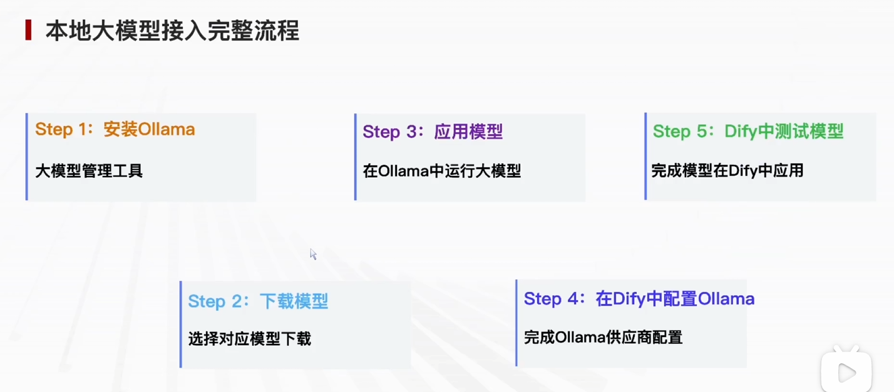
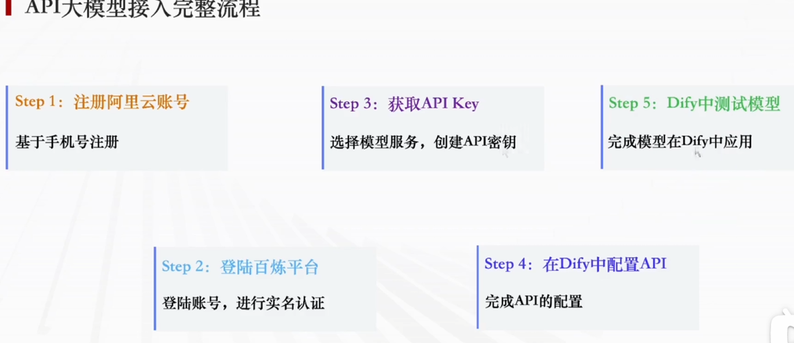

# 2. Dify 第二章学习笔记

---

## 2.1 Ollama 安装与应用

### 第一步：安装 Ollama

**1. Ollama 介绍**

Ollama 是**开源本地大模型运行框架**，可在本机部署、管理、运行各类开源 LLM 大语言模型，本地离线推理。搭配已部署好的 Dify 可实现本地大模型接入 Dify，无需调用第三方付费 API。

**2. 下载渠道**

| 平台 | 方式 |
|-----|------|
| 官方下载 | https://ollama.com/download |
| 支持系统 | Windows / macOS / Linux |

Windows 直接下载安装包，双击一路下一步完成安装。

**3. Windows 安装配套优化**

- 安装完成后自动后台启动 Ollama 服务，默认本地端口 **11434**
- 国内下载模型慢 → 配置 `OLLAMA_MIRROR` 镜像环境变量
- 防火墙放行 **11434** 端口，Dify 才能访问本地 Ollama 服务

---

### 第二步：下载本地大模型

**客户端操作流程**

打开 Ollama 桌面聊天客户端，在顶部输入框搜索模型：

| 模型 | 大小 | 说明 |
|-----|------|------|
| **qwen2.5:1.5b** ⭐ | 940 MB | 新手推荐，低配流畅运行 |
| **qwen3:4b** | ~2 GB | 进阶，能力更强 |
| **qwen3:8b** | ~5 GB | 更强，硬件要求更高 |

**下载触发规则：** 搜索到模型后，随便发条消息（如"你好"），自动开始下载。

---

### 第三步：本地对话使用模型

- 模型下载完毕后，直接在对话框提问即可本地离线对话
- 客户端支持**联网检索增强**，可开启联网功能做实时问答

---

### 第四步：对接 Dify（实训核心）

**连通前置条件**

| 条件 | 说明 |
|-----|------|
| ✅ Ollama 正常运行 | http://localhost:11434 可访问 |
| ✅ 防火墙放行 | 11434 端口已放行 |
| ✅ Dify 容器正常 | 全套容器 Up 状态 |

**Dify 内接入步骤**

1. 浏览器打开 `http://localhost` 进入 Dify 后台
2. 左侧菜单 → **模型供应商** → 找到 **Ollama**
3. 填写 API 地址：`http://host.docker.internal:11434`
4. 填入本地下载的模型名称（如 `qwen2.5:1.5b`）
5. 保存配置，即可在 Dify 应用中调用本地大模型

**常见排坑**

| 问题 | 解决方案 |
|-----|---------|
| 模型下载卡死 | 配置国内镜像，或换 1.5b 小模型 |
| Dify 无法连接 Ollama | 检查端口放行、host.docker.internal |
| 对话回复卡顿 | 换更小模型，关闭后台占用程序 |

---

### 简答题

**Q：什么是 Ollama？**
> **答案：** Ollama 是一款开源本地大模型管理工具，支持 Windows/macOS/Linux 系统，可本地下载、运行、管理各类开源 LLM 大语言模型，提供本地 API 服务供 Dify 等平台对接调用。

**Q：如何在 Dify 中应用本地模型？**
> **答案：**
> 1. 安装 Ollama 客户端
> 2. 下载本地大模型（推荐 qwen2.5:1.5b）
> 3. 本地对话验证模型可用
> 4. 登录 Dify 后台 → 设置 → 模型供应商
> 5. 安装 Ollama 集成插件
> 6. 配置连接地址与模型名称（`http://host.docker.internal:11434`）
> 7. 保存配置，测试调用

---

## 2.2 Dify 接入本地大模型

### 步骤 1：进入全局设置

1. 浏览器打开 `http://localhost` 登录 Dify 管理员账号
2. 右上角点击用户头像 → **设置**
3. 进入工作空间配置面板

### 步骤 2：安装 Ollama 模型供应商

1. 左侧切换到 **模型供应商**
2. 右上角点击 **安装模型供应商**
3. 搜索 `Ollama`，找到 `langgenius/ollama` 官方包
4. 点击安装

### 步骤 3：配置本地模型连接参数

| 配置项 | 值 |
|-------|-----|
| **模型名称** | `qwen2.5:1.5b`（与 Ollama 下载名一致） |
| **模型类型** | LLM（对话大语言模型） |
| **基础 URL** ⚠️ | `http://host.docker.internal:11434` |
| **上下文长度** | 4096 |
| **最大 Token** | 4096 |

> ⚠️ **注意：** 本机 Docker 部署必须用 `host.docker.internal`，不能写 `localhost`

### 配套前置校验

- ✅ Ollama 服务监听 11434 端口
- ✅ 防火墙放行 11434 端口
- ✅ 浏览器访问 `http://localhost:11434` 正常响应
- ✅ Dify 容器全部为 Up 状态

### 常见报错排查

| 报错 | 原因 | 解决 |
|-----|------|------|
| 连接超时 | 基础 URL 写错 | 本机 Docker 必须用 `host.docker.internal` |
| 模型不存在 | 名称不一致 | 检查大小写和冒号格式，如 `qwen2.5:1.5b` |
| 推理卡顿 | 模型太大 | 换更小参数模型，降低内存占用 |

---

## 2.3 Dify 接入 API 大模型

### 一、什么是大模型 API？

> **答案：** 远程调用云端大模型能力的接口，无需自己部署和维护模型。

各大云厂商将训练好的大模型部署在云端，开发者传入提示词即可获取回复，节省本地硬件资源。

### 二、如何在 Dify 中应用大模型 API？

**精简版（填空题答案）：**
> 申请 API Key → 下载对应供应商 → 添加模型配置 → 应用测试模型

**完整分步流程（阿里云百炼示例）：**

| 步骤 | 操作 |
|-----|------|
| **Step 1** | 手机号注册阿里云账号 |
| **Step 2** | 登录百炼平台，完成实名认证 |
| **Step 3** | 开通模型服务，创建并复制 API Key |
| **Step 4** | 登录 Dify → 安装阿里云百炼供应商 → 填写 API Key 和接口地址 |
| **Step 5** | 保存配置，创建对话应用测试云端模型调用 |

---

### 本章小结

- ✅ 掌握了 **Ollama** 的安装、配置与使用
- ✅ 学会了下载和运行**本地大模型**
- ✅ 实现了 **Dify 对接 Ollama** 本地模型
- ✅ 了解了 **Dify 接入云端 API** 的完整流程
- ✅ 掌握了两种模型接入方式的适用场景

---
*整理日期：2026 年 7 月 14 日*
