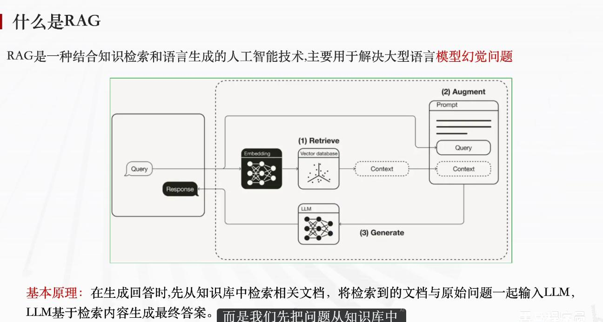

# 4. Dify 第四章学习笔记 — RAG 原理与知识库搭建

---

## 4.1 RAG 基本原理



### 一、标准答案（试卷标准答案）

先基于用户问题从知识库检索匹配的相关上下文，再把**原始用户问题 + 检索到的上下文资料**一同送入大语言模型（LLM），模型依托检索到的真实资料生成准确回答。

---

### 二、分层拆解完整原理（三段式流程 Retrieve-Augment-Generate）

| 阶段 | 英文 | 说明 |
|------|------|------|
| **① 检索** | Retrieve | 用户提问经 Embedding 转为向量，去知识库匹配相似度最高的文档片段 |
| **② 增强** | Augment | 把检索到的上下文 + 用户原始提问拼接，构建携带外部资料的完整提示词 |
| **③ 生成** | Generate | 将增强后的提示词送入大模型，模型仅基于检索到的真实内容生成回复 |

#### 阶段详解

**1. Retrieve 检索阶段**

用户提问（Query）先经过嵌入模型（Embedding）转为向量，去向量数据库/知识库中匹配相似度最高的文档片段，取出相关参考上下文。

**2. Augment 增强提示词阶段**

把检索得到的真实知识上下文，和用户原始提问拼接整合，构建携带外部资料的完整提示词。

**3. Generate 生成回答阶段**

将增强后的提示词输入大模型，模型仅基于检索到的真实文档内容生成回复，避免凭空编造。

---

### 三、核心作用与背景

| 问题 | 说明 |
|------|------|
| **传统 LLM 缺陷** | 训练数据固定，存在知识滞后、信息过时问题，容易产生**模型幻觉**（编造不存在的内容） |
| **RAG 解决方案** | 解决大模型幻觉、知识滞后问题，**无需重新训练模型**，仅通过外挂知识库实时补充最新、私有资料 |

---

### 四、业务场景举例

**场景：** 用户询问 LOL 新英雄「流光镜影」技能

| 步骤 | 说明 |
|------|------|
| 1. **检索** | 从上传的 LOL 新版本知识库中，检索该英雄技能文档 |
| 2. **增强** | 把英雄技能资料 + 用户提问拼接为完整提示 |
| 3. **生成** | 模型依据真实文档输出准确介绍，不会回复"不存在该英雄" |

---

### 简答题

**Q：什么是 RAG？**
> **答案：** RAG（Retrieve-Augment-Generate）是一种让大模型先检索外部知识库获取相关资料，再将资料与用户问题拼接送入模型生成回答的技术，解决模型幻觉和知识滞后问题。

**Q：RAG 的三段式流程是什么？**
> **答案：** Retrieve（检索）→ Augment（增强）→ Generate（生成）。先向量检索匹配文档片段，再拼接提示词，最后基于真实资料生成回答。

---

## 4.2 RAG 知识库如何搭建

### 一、简答标准答案（考试直接写）

知识库搭建分为三步：**文档准备 → 文档切片 → 文档向量化**

---

### 二、分步详细操作说明

### 1. 文档准备

**① 文件类型区分**

| 类型 | 支持格式 | 适用场景 | 举例 |
|------|---------|---------|------|
| **文档类** | PDF、Word、TXT、MD | 教程、攻略类文本资料 | LOL 英雄攻略 `.md` 文件 |
| **表格类** | Excel、CSV | 结构化统计数据 | LOL 英雄属性表格 |

**② 预处理规范**

| 规范项 | 说明 |
|-------|------|
| 清理杂质 | 去除水印、广告、无效冗余内容 |
| 按主题分类 | 按业务主题对文件分类存放 |
| 文件命名 | 包含核心关键词，方便识别检索 |

---

### 2. 文档切片（切分文本）

**① 切片目的**

适配大模型上下文长度限制，拆分长文本，提升检索精准度与查询效率。

**② 三种切分方式**

| 切分方式 | 说明 | 适用场景 |
|---------|------|---------|
| **按字符数切分** | 固定长度分段（推荐 200~500 字/段） | 通用场景 |
| **按符号切分** | 以句号、换行、感叹号等标点为分割点 | 结构清晰的文本 |
| **按语义切分** | AI 识别主题变化，智能拆分逻辑段落 | 复杂长文 |

**③ 通用最优方案：符号 + 字符长度混合切分**

| 切片不当的后果 | 说明 |
|---------------|------|
| 片段太短 | 上下文缺失，检索匹配不准 |
| 片段过长 | 混入无关内容，干扰模型判断 |

---

### 3. 文档向量化

**核心定义**

将切片后的文本转化为数字向量，把语义信息数字化存入向量库。

**核心作用**

| 作用 | 说明 |
|------|------|
| ✅ 实现文本语义理解 | 机器可读懂内容含义 |
| ✅ 快速计算相似度 | 计算用户提问与知识库片段的相似度 |
| ✅ 高速检索匹配 | 筛选最匹配的参考上下文供大模型使用 |

**工作逻辑**

用户问题、知识库文本都会转为多维数字向量，通过**向量夹角距离**判断语义相似度，筛选最匹配的参考上下文供大模型使用。

---

### 三、搭建完成后 RAG 调用链路

```
用户提问 → 问题向量化检索知识库片段 → 检索内容 + 问题拼接提示词 → 大模型基于真实文档生成回答，解决模型幻觉、知识滞后问题。
```

---

## 4.3 实战：LOL 游戏助手完整流程

### 阶段一：搭建 LOL 攻略知识库（RAG 素材准备）

| 步骤 | 操作 | 说明 |
|------|------|------|
| **Step 1** | 创建知识库 | 登录 Dify 平台，新建专属知识库 |
| **Step 2** | 选择数据源 | 上传英雄介绍、技能攻略、出装指南等文档 |
| **Step 3** | 文本分段 | 设置切片规则（推荐符号 + 字符混合切分，200-500 字/段） |
| **Step 4** | 构建向量索引 | 对分段文本执行向量化处理 |
| **Step 5** | 检索配置 | 选择向量/全文/混合检索模式 |
| **Step 6** | 预览校验 | 查看切片与向量化处理效果 |

#### 📎 知识库素材文档示例

以 `英雄联盟《芸阿娜》介绍.md` 为例，这是一份上传到知识库的典型英雄攻略文档，包含：

| 内容模块 | 说明 |
|---------|------|
| **英雄定位** | 艾欧尼亚 ADC，依靠平A持续输出 |
| **技能介绍** | 被动「初生之誓」、Q「灵蕴拳」、W「善恶轮」、E「明踪步」、R「定圣诀」 |
| **连招教学** | 对线消耗连招、团战连招 |
| **装备搭配** | 出门装 → 荒野剑 → 迅刃 → 无尽之刃 |
| **技能加点** | 主 Q 副 E，有大点大 |
| **辅助搭配** | 露露、悠米、风女、卡尔玛、娜美等软辅 |
| **符文选择** | 发育打团流（致命节奏）/ 对线爆发流（强攻） |

> 知识库就是由这样一份份结构化的游戏文档组成，RAG 从中检索相关内容辅助模型回答。

---

### 阶段二：创建 Agent 智能体并绑定知识库

| 步骤 | 操作 |
|------|------|
| **Step 1** | 新建空白应用，创建 LOL 游戏助手对话 Agent |
| **Step 2** | 编写系统提示词，设定游戏助手角色、答疑功能、标准化回复格式 |
| **Step 3** | 关联知识库，在编排页面添加建好的 LOL 知识库，可多库并设置检索优先级 |
| **Step 4** | 调试验证，输入英雄相关提问（如"芸阿娜技能"），校验回答是否引用知识库真实资料 |

### 完整业务执行链路（用户提问后流程）

```
用户输入游戏相关问题
       ↓
系统向量化问题，检索知识库匹配相关文档片段
       ↓
提取检索到的芸阿娜等英雄资料作为上下文
       ↓
将用户问题 + 知识库上下文融合进提示词
       ↓
整体提示送入大语言模型 LLM
       ↓
模型依托真实文档生成准确游戏攻略回答
```

---

### 简答题精简标准答案

**Q：如何实现 LOL 游戏助手？**

> **答案：**
> 1. 搭建 LOL 知识库：上传游戏文档（如《芸阿娜》介绍.md）→ 文档切片 → 文档向量化，完成知识库存储；
> 2. 创建 LOL 游戏助手 Agent，编写提示词并绑定知识库；
> 3. 用户提问后检索知识库获取相关上下文，融合问题送入大模型，输出基于真实资料的回答。

---

### 本章小结

- ✅ 理解了 **RAG 基本原理**与三段式流程（Retrieve → Augment → Generate）
- ✅ 掌握了 RAG 解决**模型幻觉**和**知识滞后**的核心价值
- ✅ 学会了知识库搭建的**三步流程**：文档准备 → 文档切片 → 文档向量化
- ✅ 了解了三种**切片方式**及通用最优方案
- ✅ 完整实践了 **LOL 游戏助手**从知识库搭建到 Agent 绑定的全流程
- ✅ 知识库素材文档示例：`英雄联盟《芸阿娜》介绍.md`

---

*参考文档：[英雄联盟《芸阿娜》介绍.md](./doc/4/英雄联盟《芸阿娜》介绍.md)*  
*整理日期：2026 年 7 月 16 日*
