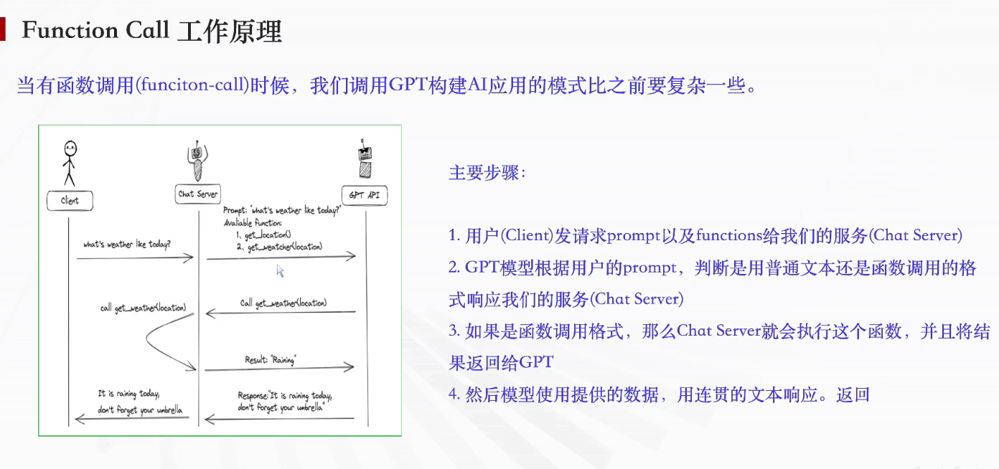
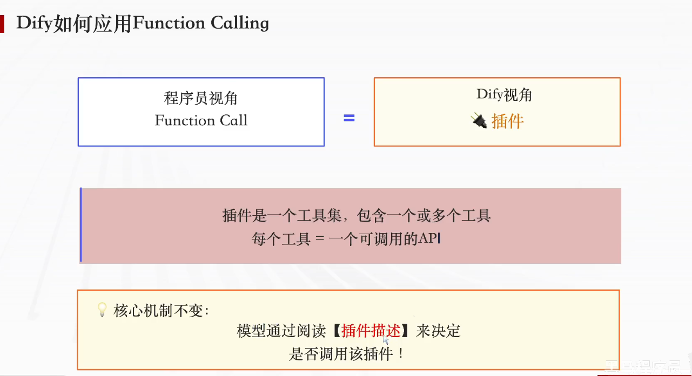
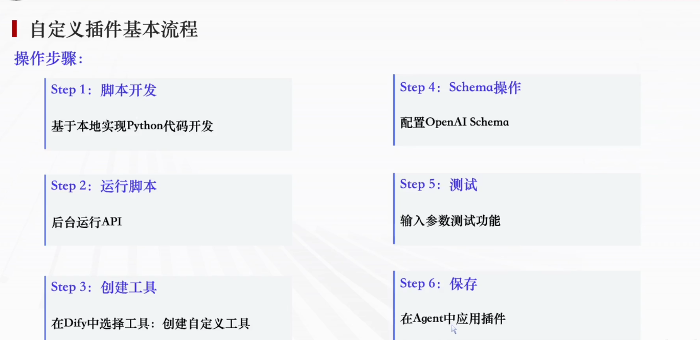

# 5. Dify 第五章学习笔记 — Function Calling 与工具应用

---

## 5.1 Function Calling 的原理



### 一、简答题标准答案

#### 1. 什么是 Function Calling（函数调用）？

> **答案：** 让大模型具备识别、调用外部工具、外部 API 的能力，模型在生成文本过程中可主动请求外部服务获取数据、执行任务。

#### 2. Function Calling 工作原理？

> **答案：** 用户发起请求 → 大模型判断是否需要调用外部函数/API → 执行对应外部函数并拿到返回结果 → 将函数结果交还给大模型 → 模型结合结果生成完整自然语言答案返回用户。

---

### 二、核心知识点完整解读

#### 1. 基础定义

Function Call 由 OpenAI 于 **2023 年 6 月 13 日**推出，核心是给大模型增加外部能力调用通道；模型不再只能依赖自身训练数据，可主动调用第三方接口、工具、数据库。

---

#### 2. 解决大模型三大核心缺陷

| 缺陷 | 问题描述 | Function Calling 解决方案 |
|------|---------|------------------------|
| **信息实时性** | 训练数据存在时间截止点，无法获取实时新闻、股价、天气 | 调用实时数据 API 获取最新信息 |
| **数据局限性** | 训练数据无法覆盖全部细分专业领域（医疗、法律等） | 对接行业专属数据库/专业 API 获取细分资料 |
| **功能扩展性** | 原生模型不支持复杂计算、文件处理、联网查询 | 通过函数调用拓展各类工具能力 |

---

#### 3. 有无 Function Call 流程对比

##### 无函数调用（传统模式）

| 步骤 | 操作 |
|------|------|
| 1 | 用户发送提问 |
| 2 | 服务端直接把问题传给大模型 |
| 3 | 模型仅依靠内部知识库作答，无外部数据则直接回复"不知道" |

##### 有函数调用（标准流程，以查天气为例）

| 步骤 | 操作 |
|------|------|
| 1 | 用户向服务端发送提问，同时传入可用函数列表 |
| 2 | 大模型分析问题，判断需要调用天气接口，返回函数调用指令 |
| 3 | 服务端本地执行天气 API，拿到天气结果 |
| 4 | 将天气原始数据传回大模型 |
| 5 | 模型整合数据，生成通顺自然的回答返回用户 |

---

#### 4. 简化业务流程图逻辑

```
输入用户问题
       ↓
大模型判断是否需要外部信息
       ↓                   
┌──── 否：直接生成文本输出，流程结束
│
└──── 是：匹配对应外部函数/API → 执行工具获取数据 → 数据送入模型整合生成最终回答输出
```

---

### 简答题

**Q：Function Calling 解决了大模型的哪些缺陷？**
> **答案：** ① 信息实时性（调用实时 API）；② 数据局限性（对接专业数据库）；③ 功能扩展性（拓展工具能力）。

**Q：有 Function Call 和没有的区别？**
> **答案：** 无函数调用时模型只能凭训练数据作答；有函数调用时模型可主动调用外部 API 获取实时/专业数据，再结合数据生成更准确的回答。

---

## 5.2 时间工具的应用



### 一、简答题标准答案

#### 1. 插件和 Function Calling 的关系？

> **答案：** 在 Dify 中，插件（工具）是 Function Calling 功能的落地实现形式，插件对应可调用的外部函数/API。

#### 2. 如何应用 Dify 插件？

> **答案：** 进入工具市场下载插件 → 创建 Agent 智能体 → 在编排页面选择绑定插件 → 完成配置即可使用。

---

### 二、核心知识点完整解析

#### 1. Dify 中 Function Calling 与插件对应关系

| 概念 | 对应关系 |
|------|---------|
| **开发视角** | Function Call = Dify 平台里的**插件** |
| **插件本质** | 工具集合，一个插件包含 1 个或多个工具；**单个工具等价于一个可调用外部 API** |
| **核心执行逻辑** | 大模型读取插件功能描述，自主判断用户提问是否需要调用该插件执行外部接口 |

---

#### 2. Dify 插件两大分类

| 分类 | 说明 |
|------|------|
| **第三方插件** | 平台内置共享插件，分为免费、付费两类；付费需要申请对应服务商 API Key |
| **自定义插件** | 用户自行开发创建，可对接任意自有业务 API，适合企业内部业务场景 |

---

#### 3. 插件四大业务类别

| 类别 | 功能举例 |
|------|---------|
| **信息查询类** | 联网搜索、实时新闻、天气、地图定位 |
| **数据分析类** | 股票行情、汇率换算、数据图表生成 |
| **内容创作类** | AI 绘图、视频生成/编辑 |
| **效率工具类** | 邮件发送、日历、翻译、计算器、时间获取 |

---

#### 4. 插件完整应用流程（以「获取当前时间」任务为例）

| 步骤 | 操作 |
|------|------|
| **Step 1** | 打开 Dify「插件/工具」市场，找到时间工具插件并下载安装 |
| **Step 2** | 新建 Agent 对话应用 |
| **Step 3** | 在应用编排模块添加已下载的时间插件 |
| **Step 4** | 编写系统提示词，告知模型可调用时间插件 |
| **Step 5** | 调试对话，输入提问，模型自动调用插件获取实时时间并整合输出 |

---

#### 5. 底层运行机制（沿用 Function Calling 逻辑）

```
用户提问 → 模型读取全部绑定插件描述 → 判断需要调用时间插件 → 执行插件接口拿到当前时间 → 将时间数据送入大模型 → 生成带时间信息的完整回答返回用户
```

---

### 简答题

**Q：Dify 中插件和 Function Calling 是什么关系？**
> **答案：** 插件是 Function Calling 在 Dify 平台的具体实现形式，一个插件包含多个工具，每个工具对应一个可调用的外部 API，底层执行逻辑完全沿用 Function Calling。

---

## 5.3 实战：天气查询插件完整实现



> 本实战基于完整教程文档，从零搭建一个可用的天气查询自定义插件，涉及 **FastAPI 后端 → 公网穿透 → Dify 插件配置 → 应用集成** 全流程。

---

### 一、简答题标准答案

#### 实现自定义插件的完整流程

| 步骤 | 操作 |
|------|------|
| **Step 1** | 本地 Python 脚本开发（FastAPI），编写业务接口逻辑 |
| **Step 2** | 后台启动服务，对外提供可访问的 API 接口 |
| **Step 3** | 配置公网穿透（localtunnel），让 Dify 能访问本地服务 |
| **Step 4** | 进入 Dify 平台，创建自定义工具 |
| **Step 5** | 配置 OpenAI Schema，定义接口入参、出参、功能描述 |
| **Step 6** | 传入参数测试插件接口功能是否正常 |
| **Step 7** | 保存自定义插件，在 Agent 应用中绑定使用 |

---

### 二、分步详细解析

#### Step 1 环境准备

安装所需依赖：

```bash
# 创建虚拟环境
python -m venv weather-env
# Windows 激活
weather-env\Scripts\activate

# 安装依赖
pip install fastapi uvicorn requests
```

---

#### Step 2 脚本开发（完整代码）

基于 **FastAPI** 编写天气查询后端，代码保存在 `main.py`：

**核心代码解析：**

```python
from fastapi import FastAPI, Request, HTTPException
from pydantic import BaseModel
import requests

app = FastAPI()

# 认证令牌（Dify 配置 Bearer Token 时需保持一致）
VALID_TOKEN = "itcast"

# 国内城市编码表
CITY_CODES = {
    "北京": "101010100",
    "上海": "101020100",
    "广州": "101280101",
    "深圳": "101280601",
    "杭州": "101210101",
    "成都": "101270101",
    "武汉": "101200101",
    "西安": "101110101",
    "南京": "101190101",
    "重庆": "101040100",
    "郑州": "101180101"
}

class WeatherRequest(BaseModel):
    location: str

@app.post("/weather")
def get_current_weather(request: Request, body: WeatherRequest):
    # 1. Bearer Token 认证校验
    auth_header = request.headers.get("Authorization")
    if auth_header != f"Bearer {VALID_TOKEN}":
        raise HTTPException(status_code=403, detail="令牌错误，访问被拒绝")

    location = body.location
    city_code = CITY_CODES.get(location)
    if not city_code:
        return {"status": "error", "message": f"暂不支持{location}"}

    # 2. 调用第三方公共天气 API
    try:
        res = requests.get(
            f"http://t.weather.itboy.net/api/weather/city/{city_code}",
            timeout=10
        )
        res.raise_for_status()
        data = res.json()
    except Exception as e:
        return {"status": "error", "message": f"天气接口请求失败：{str(e)}"}

    # 3. 解析当日天气，返回自然语言描述
    try:
        forecast = data["data"]["forecast"][0]
        weather_type = forecast["type"]
        high = forecast["high"].replace("高温 ", "")
        low = forecast["low"].replace("低温 ", "")
        return f"{location}今日天气：{weather_type}，气温{low}-{high}"
    except Exception as e:
        return {"status": "error", "message": f"数据解析失败：{str(e)}"}

# 启动入口
if __name__ == "__main__":
    import uvicorn
    uvicorn.run(app, host="0.0.0.0", port=8081)
```

| 代码模块 | 说明 |
|---------|------|
| **认证机制** | Bearer Token 校验，防止接口被滥用 |
| **城市编码** | 硬编码国内主要城市 ID，调用公共天气 API |
| **天气接口** | 使用 `t.weather.itboy.net` 免费 API |
| **返回格式** | 返回自然语言文本，便于大模型直接使用 |

---

#### Step 3 启动服务并配置公网穿透

**① 启动 FastAPI 服务**

```bash
python main.py
```

预期输出：
```
INFO:     Uvicorn running on http://0.0.0.0:8081
```

**② 安装 localtunnel（公网穿透）**

```bash
npm install -g localtunnel
```

**③ 新开终端窗口，启动穿透**

```bash
lt --port 8081
```

预期输出：
```
your url is: https://random-name-123.loca.lt
```

> ⚠️ **重要：** localtunnel 终端要保持运行，关闭后链接失效；免费链接 24 小时后过期，需每日重启。

---

#### Step 4 Dify 插件配置

**① 创建自定义工具**

登录 Dify → 侧边栏「工具」→「创建自定义工具」→ 选择 **OpenAPI** 类型

**② 填写 Schema**

```json
{
  "openapi": "3.1.0",
  "info": {
    "title": "天气查询API",
    "description": "查询中国城市当前天气信息",
    "version": "v1.0.0"
  },
  "servers": [
    {
      "url": "https://your-url.loca.lt"
    }
  ],
  "paths": {
    "/weather": {
      "post": {
        "summary": "查询城市天气",
        "security": [{"BearerAuth": []}],
        "requestBody": {
          "required": true,
          "content": {
            "application/json": {
              "schema": {
                "type": "object",
                "properties": {
                  "location": {
                    "type": "string",
                    "description": "城市名称，如北京、上海、广州",
                    "example": "北京"
                  }
                },
                "required": ["location"]
              }
            }
          }
        },
        "responses": {
          "200": {"description": "成功获取天气信息"}
        }
      }
    }
  },
  "components": {
    "schemas": {},
    "securitySchemes": {
      "BearerAuth": {
        "type": "http",
        "scheme": "bearer"
      }
    }
  }
}
```

> ⚠️ **关键：** 将 `servers.url` 替换为你实际的 localtunnel 地址

**③ 配置认证**

| 配置项 | 值 |
|-------|-----|
| 认证类型 | Bearer Token |
| Token 值 | `itcast`（与代码中 `VALID_TOKEN` 一致） |

---

#### Step 5 功能测试

在 Dify 测试面板输入参数测试：

```json
{
  "location": "深圳"
}
```

**预期返回：**
```
深圳今日天气：晴，气温27℃-33℃
```

---

#### Step 6 保存并在 Agent 中应用

1. 测试通过后点击**发布**
2. 创建/编辑 Agent 应用
3. 在编排页面添加该天气插件
4. 在系统提示词中告知模型可调用天气工具

**测试对话：**

| 用户输入 | Agent 回复 |
|---------|-----------|
| 北京今天天气怎么样？ | 北京今日天气：多云，气温22℃-32℃ |
| 上海会下雨吗？ | 上海今日天气：晴，气温28℃-35℃ |

---

### 三、常见问题排查

| 问题 | 原因 | 解决方案 |
|------|------|---------|
| `Reached maximum retries` | Dify 无法访问 localhost | 必须使用公网 URL，不能用 `localhost` |
| `{"detail":"Not Found"}` | 路由路径错误 | 检查代码中是 `@app.post("/weather")` |
| `403 Forbidden` | Token 不匹配 | 确认 `VALID_TOKEN` 和 Dify 配置一致 |
| 连接超时 | localtunnel 断开 | 重启 `lt --port 8081`，更新 Dify 中的 URL |
| 城市未找到 | 城市不在编码表 | 在 `CITY_CODES` 中添加该城市编码 |

**快速诊断命令：**

```bash
# 检查本地服务
netstat -ano | findstr 8081

# 测试接口
curl -X POST https://your-url.loca.lt/weather \
  -H "Authorization: Bearer itcast" \
  -H "Content-Type: application/json" \
  -d "{\"location\": \"杭州\"}"
```

---

### 四、核心补充说明

#### 1. Schema 的作用

Schema 是大模型与自定义 API 的沟通规范，模型依靠描述和参数定义，自主识别**何时调用插件**、**需要收集哪些用户信息**。

| Schema 要素 | 说明 |
|------------|------|
| **工具名称与描述** | 大模型识别该工具用途的依据 |
| **请求路径与方式** | API 调用地址和 HTTP 方法 |
| **参数定义** | 调用时需要用户提供哪些信息 |
| **认证配置** | 接口安全校验（Bearer Token） |

#### 2. 自定义插件与第三方插件区别

| 对比维度 | 第三方插件 | 自定义插件 |
|---------|-----------|-----------|
| **来源** | 平台现成封装 | 用户自行开发 |
| **适用场景** | 通用功能（搜索、天气、翻译） | 企业内部业务、个性化定制 |
| **API 归属** | 第三方服务商 | 自有私有 API |
| **灵活性** | 固定功能 | 高度灵活可定制 |

#### 3. 底层逻辑关联 Function Calling

```
自定义插件本质 = 落地 Function Calling
    外部 API = 函数
    Schema   = 函数入参说明
    整套流程让大模型具备调用自研接口的能力
```

---

### 简答题

**Q：自定义插件的完整开发流程是什么？**
> **答案：**
> 1. Python 脚本开发后端接口（FastAPI）
> 2. 启动服务对外暴露 API（uvicorn）
> 3. 配置公网穿透（localtunnel）
> 4. Dify 平台创建自定义工具，配置 OpenAI Schema
> 5. 填入 Bearer Token 认证信息
> 6. 测试接口功能
> 7. 保存并在 Agent 中绑定使用

**Q：Schema 在自定义插件中起什么作用？**
> **答案：** Schema 是大模型与自定义 API 的沟通规范，模型通过 Schema 中的描述和参数定义，自主识别何时调用插件以及需要收集哪些用户信息。

---

### 本章小结

- ✅ 理解了 **Function Calling** 的概念、原理与解决的核心问题
- ✅ 掌握了有/无 Function Call 的**流程对比**
- ✅ 学会了 Dify 中**插件与 Function Calling** 的对应关系
- ✅ 了解了**第三方插件**与**自定义插件**的区别与使用场景
- ✅ 完整实现了**天气查询插件**：FastAPI 后端 + localtunnel 穿透 + Dify Schema 配置 + Agent 集成

---

*参考文档：[自定义天气查询插件完整教程.md](./doc/5/自定义天气查询插件完整教程.md)*  
*插件源码：[main.py](./doc/5/main.py)*  
*整理日期：2026 年 7 月 16 日*
