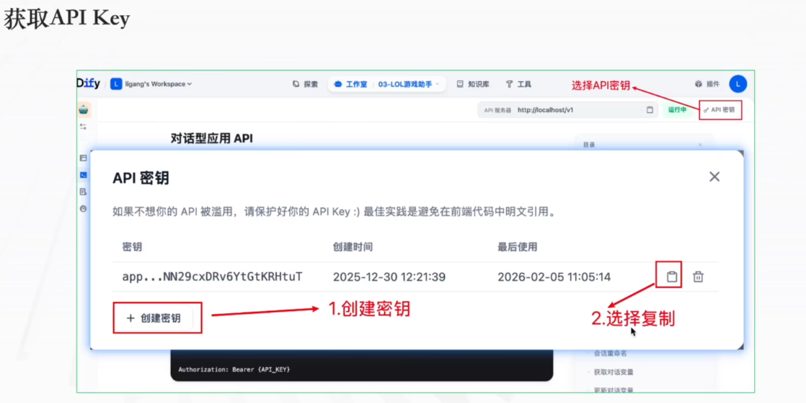
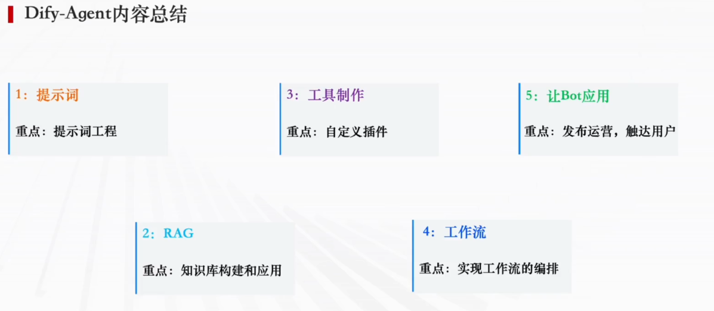
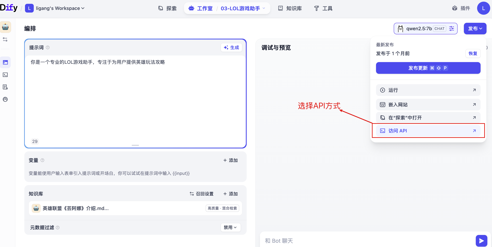
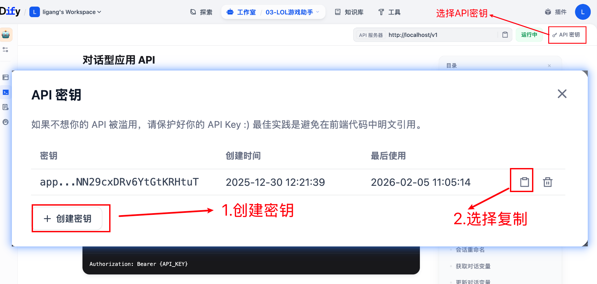
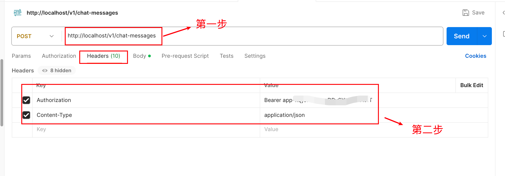
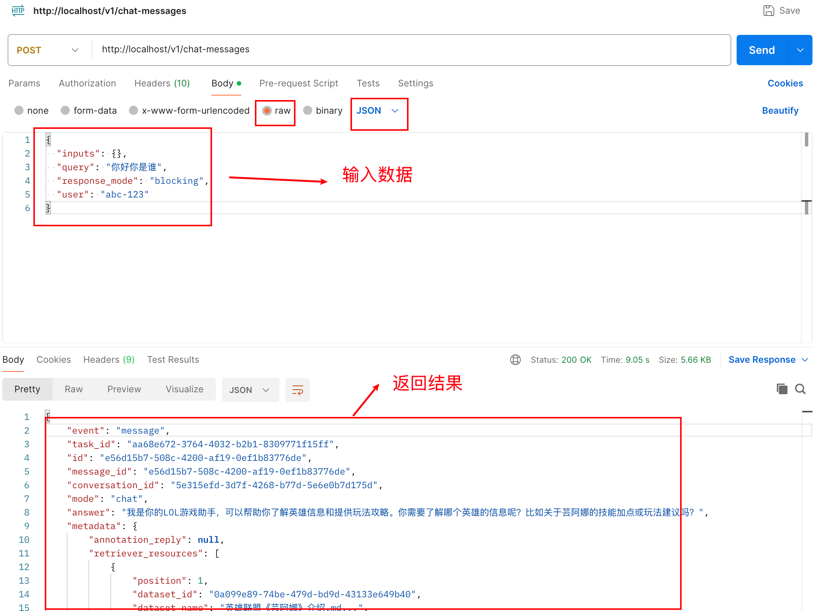

# 7. Dify 第七章学习笔记 — Agent 应用发布与集成

---

## 7.1 Agent 嵌入网站应用

### 一、功能说明

本案例基于 Dify 平台的 Agent 应用（NLP2SQL 数据分析助手），将智能对话助手以**右下角悬浮聊天窗口**形式嵌入自有网站。用户在网页内即可直接与 AI 对话，实现自然语言转 SQL、数据分析、图表生成等功能。

### 二、核心知识点详解

#### 嵌入流程四步骤

| 步骤 | 操作 | 说明 |
|------|------|------|
| ① 打开嵌入入口 | 进入已编排完成的 Agent 工作流 → 右上角「发布」→「嵌入网站」 | 确保工作流已保存并发布 |
| ② 选择嵌入模式 | Dify 提供 3 种方案：悬浮弹窗 / 内联 iframe / 弹出窗口 | 本案例使用悬浮弹窗模式（推荐） |
| ③ 部署嵌入代码 | 将 JS 脚本粘贴到网站 HTML 的 `<body>` 标签末尾 | 静态/动态项目均可部署 |
| ④ 测试运行 | 刷新网页，验证右下角悬浮按钮和对话功能 | 测试 NLP2SQL 查询与图表输出 |



#### 三种嵌入模式对比

| 模式 | 特点 | 适用场景 |
|------|------|---------|
| **悬浮弹窗模式** ✅ | 右下角浮动按钮，点击展开聊天窗口 | 通用客服/助手，用户体验最佳 |
| 内联 iframe 模式 | 直接嵌入页面指定区域 | 页面内嵌工具，固定位置展示 |
| 弹出窗口模式 | 新开标签页 | 独立对话页面，不干扰主站布局 |



#### 工作流回顾（Agent 内部逻辑）

```
用户输入 → LLM 生成 SQL → SQL 验证提示 → 代码执行（数据库查询）→ 返回结果 + 图表
```

用户在悬浮聊天框提问后，整套工作流自动执行，最终可输出 ECharts 可视化图表。

#### ⚠️ 常见注意事项

- **网络访问**：部署网站必须能正常访问 Dify 服务地址，内网部署需处理跨域
- **权限**：Agent 应用必须先完成发布更新，未发布的工作流无法被嵌入调用
- **跨域报错**：若网页打不开聊天窗口，需在 Dify 服务配置允许目标网站跨域
- **样式自定义**：嵌入弹窗内支持自定义窗口标题、颜色、初始欢迎提示词

### 简答题

**Q：Dify Agent 嵌入网站有哪几种模式？推荐使用哪种？**
> **答案：** 三种模式：悬浮弹窗模式、内联 iframe 模式、弹出窗口模式。推荐使用悬浮弹窗模式，用户体验最佳，用户点击右下角浮动按钮即可展开聊天窗口进行交互。

**Q：嵌入网站时常见的注意事项有哪些？**
> **答案：** ① 确保部署网站可正常访问 Dify 服务地址；② Agent 必须先发布更新；③ 跨域报错需配置允许目标网站跨域；④ 支持自定义窗口样式（标题、颜色、欢迎语）。

---

## 7.2 Agent 封装 API 应用

### 一、Dify 应用 API 发布与调用完整流程

#### 步骤 1：进入 API 发布入口

打开已完成编排的 Agent / 工作流应用，点击右上角 **「发布」** 下拉按钮，选择 **「访问 API」**。



#### 步骤 2：创建并获取 API Key

| 操作 | 说明 |
|------|------|
| 打开 API 密钥弹窗 | 在 API 访问页面点击「API 密钥」管理 |
| 创建密钥 | 点击「创建密钥」生成鉴权凭证 |
| 复制密钥 | 复制生成的 API Key 并妥善保存 |



> ⚠️ **安全提醒：** API Key 请勿暴露在前端页面，建议后端存储，防止密钥被盗用产生额外消耗。

#### 步骤 3：API 基础信息

| 项目 | 值 |
|------|-----|
| 基础服务地址 | `http://localhost/v1` |
| 对话消息接口 | `POST /chat-messages` |
| 鉴权 Header | `Authorization: Bearer {API_KEY}` |
| 必带 Header | `Content-Type: application/json` |

#### 步骤 4：请求参数说明（发送对话消息）

| 参数 | 类型 | 必填 | 说明 |
|------|------|------|------|
| `query` | string | 是 | 用户输入的消息内容 |
| `inputs` | object | 否 | 初始变量值（可覆盖 Start Node 默认值） |
| `response_mode` | string | 是 | `streaming`（流式）或 `blocking`（阻塞） |
| `user` | string | 是 | 用户标识 |
| `conversation_id` | string | 否 | 会话 ID，为空则新建会话 |

#### 步骤 5：Postman 测试步骤

| 步骤 | 操作 | 图示 |
|------|------|------|
| ① | 请求方式选择 **POST**，填入接口完整地址 | - |
| ② | Headers 标签页填入两条请求头 |  |
| ③ | Body 选择 `raw` → `JSON` 格式，填入请求 JSON |  |
| ④ | 点击 **Send** 发送请求，接收 AI 返回结果 | - |

**请求 JSON 示例：**

```json
{
    "inputs": {},
    "query": "统计各班平均分",
    "response_mode": "blocking",
    "user": "test-user"
}
```

### 二、Dify Agent 整体知识模块总结

| 模块 | 核心内容 | 作用 |
|------|---------|------|
| **提示词工程** | 定义智能体角色、约束输出格式 | Agent 行为的核心驱动力 |
| **RAG 检索增强** | 知识库构建、文档分片、向量索引、关联应用 | 实现资料问答 |
| **工具制作（Function Call）** | 自定义插件开发，大模型调用外部 API | 扩展 Agent 能力边界 |
| **工作流编排** | 可视化节点编排，搭建自动化业务流程 | 区分 Workflow 与 Chatflow |
| **Bot 发布应用** | 应用发布、开放 API 接口、对接外部系统 | 面向终端用户交付服务 |

### 三、简答题整理（可直接背诵）

**Q1：Dify 应用如何对外提供 API 调用？**
> **答案：** ① 完成 Agent/工作流编排后，点击发布，选择「访问 API」；② 进入 API 密钥管理，创建密钥并复制保存；③ 使用基础 URL、接口路径，在请求头携带 `Authorization: Bearer API_KEY` 完成鉴权；④ 按照接口文档组织 JSON 请求体，使用 Postman 或代码发起 HTTP 请求调用。

**Q2：API Key 安全注意事项有哪些？**
> **答案：** API Key 不能直接放在前端代码中，应当在后端服务保管。一旦泄露，他人可盗用接口产生资源消耗。

**Q3：Dify 五大核心模块是什么？**
> **答案：** ① 提示词工程；② RAG 知识库；③ 自定义插件（Function Call）；④ 可视化工作流编排；⑤ 应用发布与 API 交付。

---

## 本章小结

- ✅ 掌握了 Dify Agent 嵌入网站的操作流程（悬浮弹窗模式）
- ✅ 理解了三种嵌入模式的区别与适用场景
- ✅ 学会了 Dify 应用发布 API 的完整流程
- ✅ 掌握了 API Key 创建、鉴权方式及 Postman 测试方法
- ✅ 系统回顾了 Dify 五大核心知识模块
- ✅ 整理了 Agent 应用发布相关的简答题

---

*参考文档：[API接口的创建方式](./doc/7/API接口的创建方式.md) · [数据库分析助手HTML](./doc/7/database_assistant.html)*
*整理日期：2026 年 7 月 21 日*
